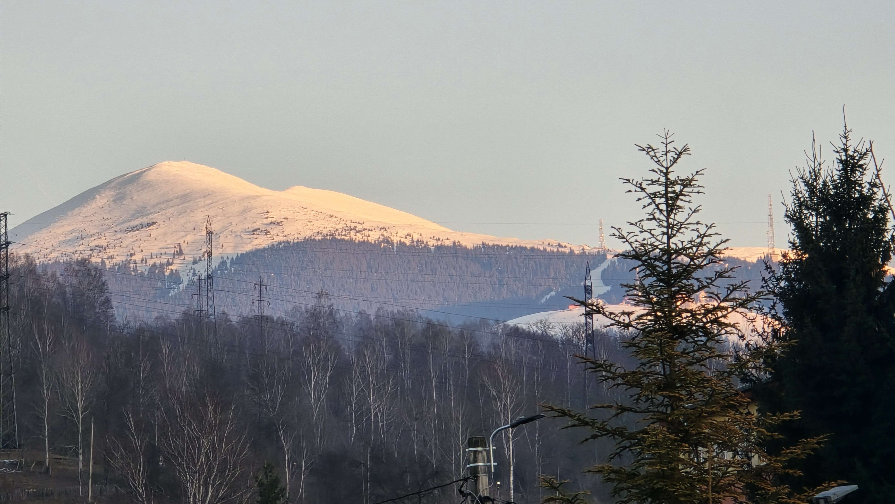
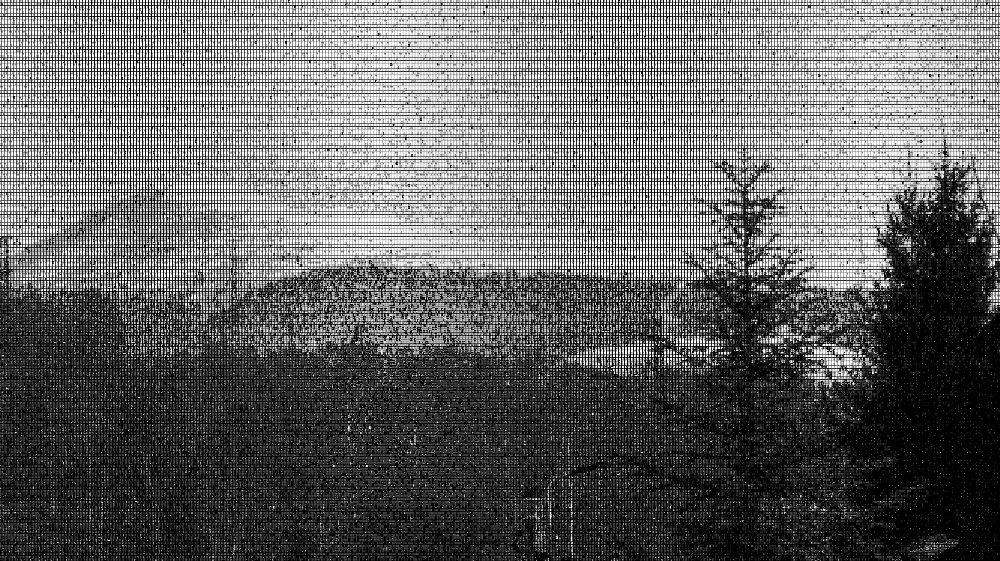

# asciidra

Convert images to ASCII art using deep learning techniques that are stochastic gradient descent based.

## CLI Description

The CLI is exposed using the `Args` class, which contains the following parameters:

- `input`: Path to the RGB input image.
- `chars`: Path to the character sheet.
- `font`: Path to the font file.
- `output`: Path to the output directory.
- `glyphs`: Path to create glyphs.
- `size`: Size of the font text.
- `pad`: Character padding all sides.
- `max_steps`: Maximum optimization iterations.
- `eps`: Error threshold to end optimization.
- `eta`: Convergence rate.
- `tau`: Gumbel-Softmax smoothness factor.
- `ema`: Exponential moving average for solution params.
- `seed`: Seed to reproduce output.
- `device`: Accelerator used to run the code.

## Example Usage

```shell
uv run python -m asciidra                                 \
    --font /usr/share/fonts/noto/NotoSansMono-Regular.ttf \
    --input ./resources/images/landscape.jpg              \
    --chars ./resources/charsets/square.txt               \
    --output ./resources/output                           \
    --glyphs ./resources/glyphs                           \
    --device 'cuda:0'                                     \
    --eps 0.005                                           \
    --steps 1000                                          \
    --eta 1.25                                            \
    --tau 0.95                                            \
    --seed 42                                             \
    --pad 0.0                                             \
    --size 8
```

## Examples

### Input Image



### ASCII Image


